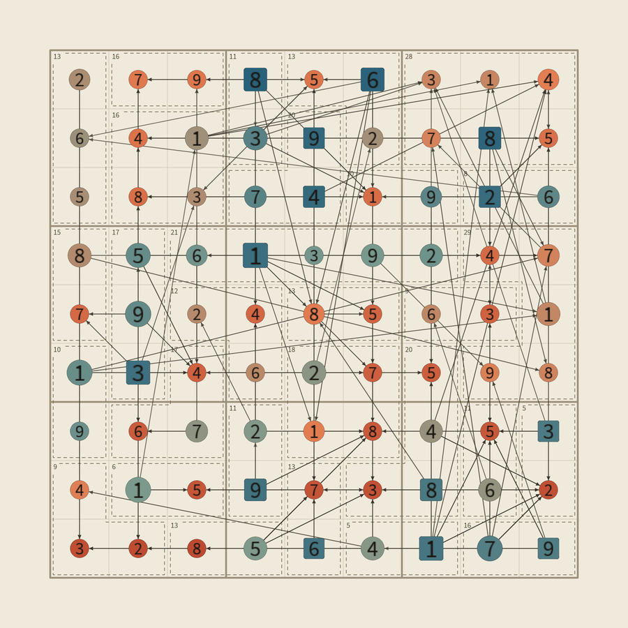
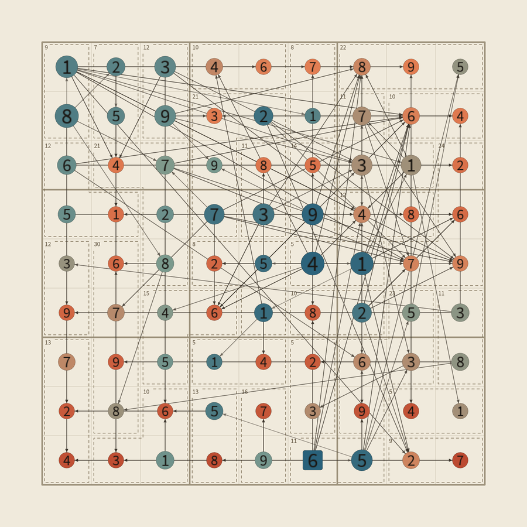
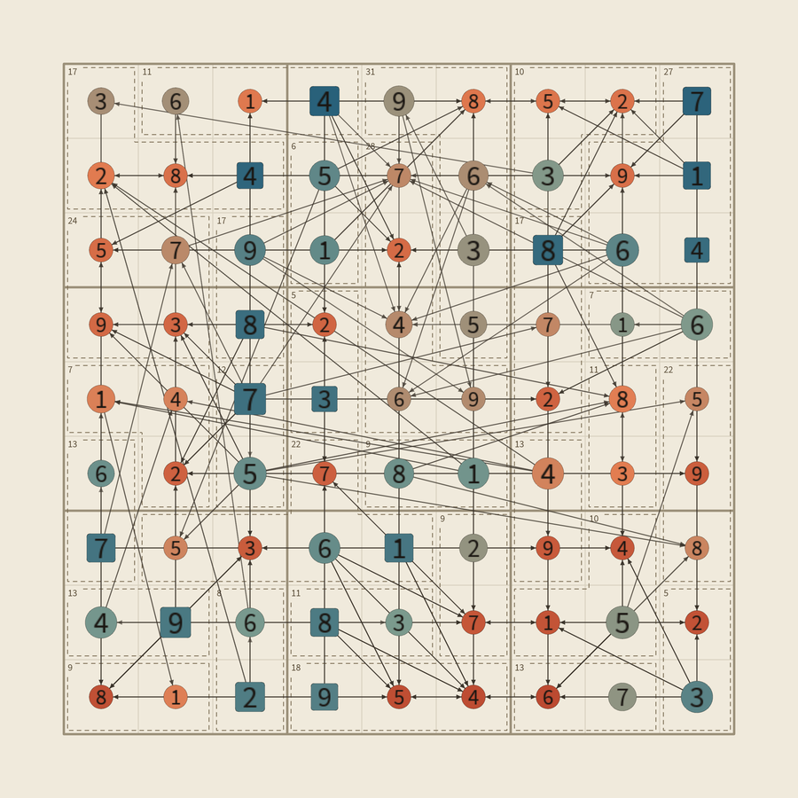
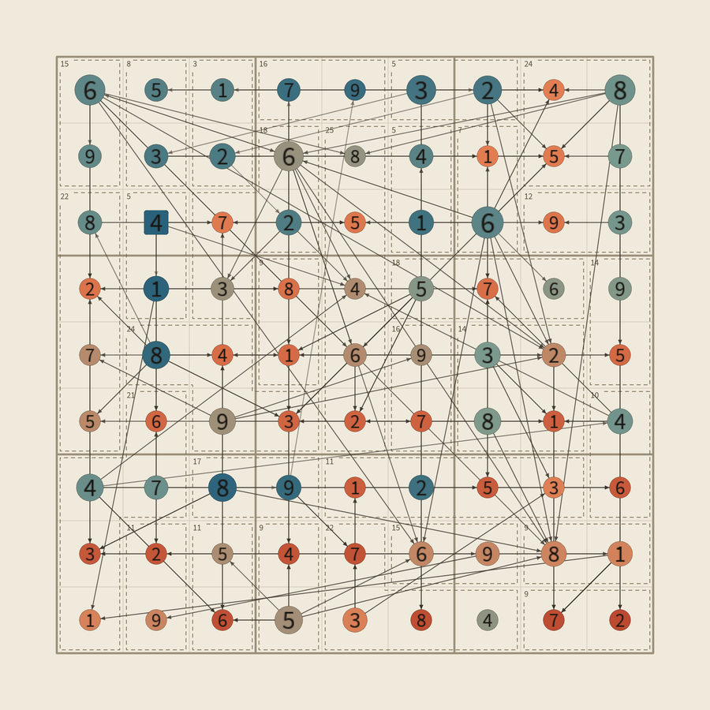

# killer_sudoku

A killer sudoku solver that records every deduction it makes, rendered as a
dependency graph over the grid: one node per resolved cell, sized by how many
cells eventually depended on it; arrows from the cells that caused each
deduction; and a rounded square where the solve started: the givens, or the
first solved cell when a puzzle has none (like the app's hardest level, "Killer").

Input-driven rather than random: there is no seed and a single fixed style.
A piece is reproduced from the puzzle file, the render settings, and the
commit (all recorded in the PNG metadata).

## Showcase

Each piece is one solved puzzle. Circles are solved cells, sized by how many
other cells eventually depended on them; arrows point from a cell to the cells
it helped deduce; color runs from cool blue (solved early) to warm terracotta
(solved late); rounded squares mark where the solve started.

| | |
|:---:|:---:|
|  |  |
| `001_hard` — "Hard", 14 givens, typed by hand | `002` — "Killer" (no givens), read from a screenshot |
|  |  |
| `003` — "Hard", 15 givens, read from a screenshot | `004` — "Killer" (no givens), read from a screenshot |

Rendered with `sketch.py --puzzle <name> --save-and-exit` (final state, step
coloring), scaled to 900 px; full-resolution originals with metadata are
written to `output/`.

## Run

From a screenshot of the app to a piece:

```powershell
uv run python projects/killer_sudoku/read_screenshot.py "path/to/screenshot.jpg"
uv run python projects/killer_sudoku/solve.py --puzzle 004
uv run python projects/killer_sudoku/sketch.py --puzzle 004
```

`read_screenshot.py` finds the board, the cage outlines, the sums and any
givens, and writes `puzzles/<name>.yaml` (default name: the next free number).
It never guesses: anything it isn't certain about (a digit, a cage border) is
asked in the terminal, and answered digits are saved as new references in
`reader_templates/`. A cell selected in the app (its teal and shaded
highlights) doesn't matter. Before writing, it shows the puzzle as a text grid
to check against the app, and refuses puzzles that fail validation (sums
total 405, every sum possible for its cage size, no repeated givens).

A screenshot dropped into `screenshots/` can be passed by its file name alone.
The reader is tuned to one app's look; `screenshots/` keeps the two examples
the tests use (other screenshots there are ignored by git).

To write a puzzle by hand instead, follow the format of `puzzles/001_hard.yaml`.

Then the two stages. First solve the puzzle, which writes `traces/<name>.json`:

```powershell
uv run python projects/killer_sudoku/solve.py --puzzle 001_hard
```

Then render the trace:

```powershell
uv run python projects/killer_sudoku/sketch.py --puzzle 001_hard
```

Reproduce a specific piece:

```powershell
uv run python projects/killer_sudoku/sketch.py --puzzle 001_hard --step 30 --color-mode inference --save-and-exit
```

Tests:

```powershell
uv run pytest
```

## Keys

- `s` — save current piece (via `save_artwork`)
- `m` — toggle color mode (`step` / `inference`)
- `c` — toggle cage outlines and sums
- `r` — reload the trace and re-render
- `Left` / `Right` — step back / forward by 1
- `Down` / `Up` — step back / forward by 10
- `b` / `e` — beginning (first step) / end (full solve)

## Parameters

- `--puzzle` — puzzle name (a file in `puzzles/`, without `.yaml`). Default `001_hard`.
- `--step` — render only events up to this step. Default: final state.
- `--color-mode` — `step` (cool to warm over time) or `inference` (by rule).
- `--cages` / `--no-cages` — cage outlines and sums.
- `--save-and-exit` — save once and exit without interaction.

## Layout

- `killer_solver/` — puzzle loading, deduction rules, solver, trace format.
  Local to this project (no other project reuses it).
- `killer_solver/screenshot.py` — the screenshot reader (image → cages, sums, givens).
- `read_screenshot.py` — command-line tool around the reader (questions, check, write).
- `reader_templates/` — reference images of each digit, as sums and as givens.
- `screenshots/` — example screenshots used by the tests.
- `puzzles/` — input puzzles (YAML).
- `traces/` — solver output (JSON, gitignored, regenerable with `solve.py`).
  Each trace records the commit of the solver that produced it.
